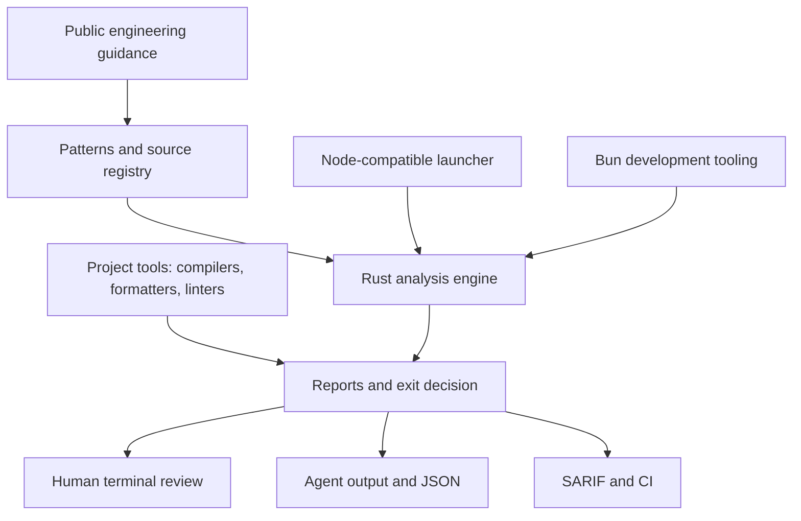

# Nice Code

Source-backed engineering patterns and guardrails for reliable software development.

Nice Code helps humans and AI-assisted developers catch important engineering mistakes that
formatters, compilers, and linters cannot fully judge:

- Logging without useful context or with sensitive data
- Sequential async work and unsafe concurrency
- Weak error boundaries and swallowed failures
- Incorrect state ownership and data flow
- Unsafe persistence and migration behavior
- Tests that pass without protecting real behavior
- Unmeasured performance claims
- Security and privacy mistakes
- API, reliability, and operational design gaps

Nice Code is deliberately not a replacement for language tooling. Its Rust
engine is the only analysis engine and adds a conservative, evidence-oriented
review on top of Clippy, Biome, TypeScript, Dart Analyzer, `gofmt`, framework
checks, and project-specific tests. Bun provides the launcher and development
tooling around that engine.

## Documentation site

The repository includes a VitePress documentation site for the CLI, project
integration, agent workflow, reports, audits, and pattern lifecycle.

```bash
pnpm install --dir docs
pnpm docs:dev
pnpm docs:build
```

The site is configured for GitHub Pages. The root README is the repository
entry point; the docs site is the task-oriented guide.

Read the published documentation at [sayanmohsin.github.io/nice-code](https://sayanmohsin.github.io/nice-code/).

## How it works



Every pattern is classified as:

- **Automated** — a tool can detect it reliably.
- **Agent review** — context and engineering judgment are required.
- **Human decision** — product, risk, or operational tradeoffs are involved.

Uncertain results are reported as `REVIEW`; the checker does not claim that a text search proves an
architectural or performance property.

## Quick start

Nice Code uses a Rust engine for analysis and a Node-compatible launcher for
checkout and package usage. Bun remains the preferred development runtime for
TypeScript utilities. GitHub Releases provide the prebuilt engines; npm
distribution is planned for a later release.

From this repository:

```bash
npm test
npm run check:docs

# Engine validation
bun run test:bun
bun run engine:check
```

Check another project for only changed and untracked source files:

```bash
node scripts/nice-code.mjs \
  --project /path/to/project \
  --changed
```

Run a deliberate full scan:

```bash
node scripts/nice-code.mjs \
  --project /path/to/project \
  --all
```

The checker detects Rust, Go, Dart, TypeScript, React, Astro, and Svelte projects from their
standard manifest files. It scans supported source files and does not modify the target project.

## Checker modes

| Command                  | Use                                                     |
| ------------------------ | ------------------------------------------------------- |
| `--changed`              | Fast default for local development and commits          |
| `--all`                  | Explicit deeper scan of supported source files          |
| `--ci`                   | Changed-file scan plus available native project tools   |
| `--json`                 | Machine-readable report for CI artifacts and metrics    |
| `--format agent`         | Compact, line-oriented findings for coding agents       |
| `--agent`                | Alias for `--format agent`                              |
| `--verbose`              | Show all human-readable findings in a full scan         |
| `--include-review`       | Include `REVIEW` findings in agent output               |
| `--status STATUS,...`    | Filter output by `FAIL`, `WARN`, `REVIEW`, or `PASS`    |
| `--max-findings N`       | Limit displayed or explicitly filtered findings         |
| `--new-only`             | Show only findings not present in the supplied baseline |
| `--color` / `--no-color` | Force or disable colors in human-readable output        |
| `--explain CHECK_ID`     | Show the purpose, severity, and source for a check      |

Examples:

```bash
# Fast local check
node scripts/nice-code.mjs --project . --changed

# Explain one finding
node scripts/nice-code.mjs --explain AP-LOG-001

# CI-oriented check
node scripts/nice-code.mjs --project /path/to/project --ci

# Compact output for an agent loop
node scripts/nice-code.mjs --project /path/to/project --changed --format agent

# Equivalent agent shorthand
node scripts/nice-code.mjs --project /path/to/project --changed --agent

# Keep agent context small and focused
node scripts/nice-code.mjs --project /path/to/project --all --agent --status FAIL,WARN --max-findings 20

# Save an ephemeral report and summarize it
node scripts/nice-code.mjs --project /path/to/project --all --json > /tmp/nice-code-report.json
bun scripts/metrics.mts /tmp/nice-code-report.json
```

## Node, Bun, and Rust support

Node.js runs the user-facing launcher, so normal users do not need Bun or Rust.
Bun remains the preferred local runtime for fast TypeScript script and test execution:

```bash
bun scripts/test-engine.ts
node scripts/nice-code.mjs --project . --all
```

The Rust engine can also be run directly during development:

```bash
cargo test --manifest-path engine/Cargo.toml
cargo run --manifest-path engine/Cargo.toml -- --project . --all
```

The Rust engine is the only checker. Bun is used for the launcher, tests, benchmarks, and
surrounding development tooling.

Measure before making performance claims:

```bash
npm run benchmark
```

The benchmark compares the fixture scan under available runtimes. Filesystem work, Git, and
external native tools may dominate the total time, so startup results are not a guarantee of
end-to-end improvement.

`--changed` reads the target Git diff against `HEAD` and includes untracked files. A clean project
therefore produces a report with zero scanned files. `--all` is opt-in so routine work does not
scan an entire repository unnecessarily.

Initialize an explicit project configuration without overwriting an existing one:

```bash
bun scripts/init.mts --project /path/to/project
```

The generated `.nice-code.json` supports `profiles`, path `ignore` patterns, per-check `severity`
overrides, and precise `exceptions` with a required reason. See
[`examples/project-config.json`](examples/project-config.json). Exceptions are intentionally
specific; they do not disable a whole category.

For GitHub code scanning or other SARIF consumers:

```bash
node scripts/nice-code.mjs --project . --ci --format sarif > nice-code.sarif
```

Use a baseline generated by `--write-baseline` when adopting Nice Code gradually.
`--new-only` filters findings already present in that baseline; it does not change
the underlying scan or native-tool status. See [`docs/baselines.md`](docs/baselines.md).

Create a baseline intentionally:

```bash
node scripts/nice-code.mjs --project . --all --format json --write-baseline .nice-code-baseline.json
```

JSON reports expose `schemaVersion`, `checkerVersion`, `customFindings`, `nativeTools`, `activeProfiles`,
stable `exit` information, and a `fileClass` for each finding. Findings are sorted by file, line, and
check ID so consumers can compare reports consistently. `--format agent` omits JSON decoration and
prints one actionable finding per line, which is suitable for an agent to parse without loading the
full pattern library. Human-readable output uses colors and symbols when attached to a terminal;
colors are disabled automatically for CI, redirected output, and `NO_COLOR`. Use `--color` or
`--no-color` to override that behavior.

`--new-only` filters the displayed findings; JSON does not currently add a separate
baseline summary. Full scans with findings are reported as `ADVISORY`; only
changed-scan blockers produce `BLOCKED`.
Native tools can be `PASS`, `FAIL`, or `SKIPPED`; a missing optional tool is not a Nice Code
finding.

## Reading results

```text
FAIL   AP-SEC-001  src/auth.ts:12  Possible hardcoded credential
REVIEW AP-ASYNC-001 src/data.ts:22  Multiple awaits may be independent
REVIEW AP-PERF-001 src/list.ts:8   Review collection allocation cost
```

- `FAIL` means a high-confidence critical finding or failed native CI tool.
- `WARN` means a potentially important finding that should be considered.
- `REVIEW` means the checker found a pattern requiring context or human judgment.
- `PASS` is reserved for checks that explicitly prove a condition.
- `N/A` is used in documentation and review discussions when a pattern does not apply.

CI blocks only critical custom findings and failed native tools. Warnings and review findings are
reported without blocking progress. Do not turn the output into one quality score.

## Native tooling

In `--ci` mode, Nice Code uses tools already available in the target project:

- Rust: `cargo fmt --all --check`
- TypeScript: local `tsc --noEmit`
- Biome: local `biome check .`
- Go: `go vet ./...`
- Dart: `dart analyze`

Nice Code does not install dependencies or download tools during a check. If a tool or manifest is
missing, it is skipped and the result remains explicit in JSON output.

## Commit and CI integration

Add a project script that points to the checked-out Nice Code repository:

```json
{
  "scripts": {
    "nice-code:check": "node ../nice-code/scripts/nice-code.mjs --project . --changed"
  }
}
```

For CI, use the checker as a repository step after installing the project’s own dependencies:

```yaml
- name: Run Nice Code
  run: node /path/to/nice-code/scripts/nice-code.mjs --project . --ci
```

A commit hook may run `--changed` for fast feedback. Full scans should be explicit or scheduled so
they do not add unnecessary work to every edit.

## Agent skill integration

The root [`SKILL.md`](SKILL.md) is an Agent Skills-compatible router. It tells an agent which
pattern to read for logging, persistence, performance, React, security, testing, or other work.
The detailed patterns are not loaded for unrelated tasks.

To use it globally, install or copy this repository as a skill named `nice-code` in the agent’s
skills directory. For Codex, the local destination is typically:

```text
~/.codex/skills/nice-code/
```

The skill is supplemental. Project-local `AGENTS.md` files still define repository architecture,
commands, boundaries, and exceptions.

The CLI and skill are separate on purpose: the CLI produces repeatable evidence, while the skill
helps an agent reason about context before and during a change. A project can use either one or
both.

## Patterns

Read the [pattern index](patterns/index.md) for the complete catalog. Current patterns include:

- Logging and observability
- Conditions and control flow
- Async and concurrency
- Error handling
- API boundaries
- State and data flow
- Persistence and data integrity
- Testing and verification
- Security and secrets
- Performance measurement
- Reliability and operations
- React and UI behavior
- Code review and AI-generated changes

## Adding or changing a pattern

Every pattern must include:

1. The engineering problem.
2. The recommended pattern.
3. An anti-pattern or failure example.
4. A practical example.
5. Automated, agent-review, and human-decision enforcement notes.
6. Exceptions and tradeoffs.
7. An official public source.

Do not duplicate rules already handled by a compiler, formatter, or linter unless the pattern
protects a higher-level behavior. Add positive, negative, and ambiguous fixtures for new checks.
See [CONTRIBUTING.md](CONTRIBUTING.md) for the lifecycle from proposed to adopted, revised,
deprecated, or rejected.

Review the source registry and run the monthly process in
[`docs/monthly-audit.md`](docs/monthly-audit.md) before adopting changes. This keeps the guidance
easy to improve without silently changing it or copying an entire external guide.

## Sources

The source registry is in [`sources/index.md`](sources/index.md). It currently references public
guidance from Microsoft, Google, React, Vercel, Airbnb, Dart, Go, AWS, and MDN.

Nice Code summarizes and attributes external guidance; it does not reproduce complete third-party
documents. Sources are reviewed and dated so upstream changes can be revisited deliberately.

## Monthly audit

Use [`docs/monthly-audit.md`](docs/monthly-audit.md) once a month to review sources, run deliberate
full scans, compare findings with native tools, measure false positives, and decide whether a
pattern should be adopted, revised, deprecated, or rejected. Detailed reports stay in local or CI
artifacts; only a small trend summary should be committed when needed.

## Future npm package

Releases are currently created manually from the CLI. Prepare each supported
platform binary, then publish only after the complete platform set is present:

```bash
bun run release -- prepare 0.1.2
bun run release -- prepare 0.1.2 --target x86_64-apple-darwin
bun run release -- publish 0.1.2
```

`publish` requires all five supported binaries, generates `checksums.txt`, and
uses the authenticated GitHub CLI to create the versioned Release. The release
assets are not committed to Git. Cross-compilation toolchains or separate build
machines are required for targets that are different from the release host.

npm publication is intentionally deferred while the Rust binary contract and
cross-platform release process mature. The package metadata and launcher are
being kept compatible with that future distribution. Before publishing, inspect
the exact tarball:

```bash
npm run pack:check
```

When npm publication is enabled, the same Node-compatible launcher will provide
the `nice-code` command without changing the Rust engine interface.

## License

Nice Code is released under the MIT License.
