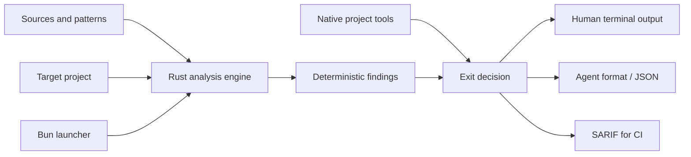

# Architecture

Nice Code keeps the review path small and explicit. Rust owns discovery,
parsing, rules, reports, and exit decisions. Bun only launches the engine and
supports development, testing, and future packaging.

The review path is:

1. Public guidance is recorded in the source registry.
2. Adapted principles become independent patterns.
3. Lightweight checks cover gaps that local tools do not already own.
4. Native project tools remain separate and authoritative.
5. Results are consumed locally, by a commit hook, by an agent, or in CI.

The checker detects the project ecosystem and scans changed files by default.
Full scans, baselines, and audits are deliberate operations.
