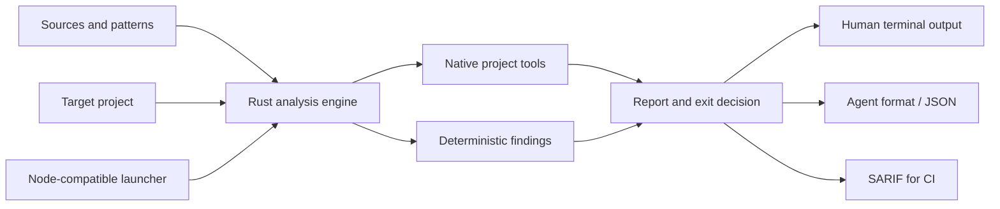

# Architecture

Nice Code keeps the review path small and explicit. Rust owns discovery,
parsing, rules, reports, and exit decisions. Node.js runs the user-facing
launcher; Bun supports development, testing, and TypeScript utilities.

The review path is:

1. Public guidance is recorded in the source registry.
2. Adapted principles become independent patterns.
3. Lightweight checks cover gaps that local tools do not already own.
4. In `--ci` mode, the engine runs available native project tools and retains their status.
5. Results are consumed locally, by a commit hook, by an agent, or in CI.

The checker detects the project ecosystem and scans changed files by default.
Full scans, baselines, and audits are deliberate operations.
