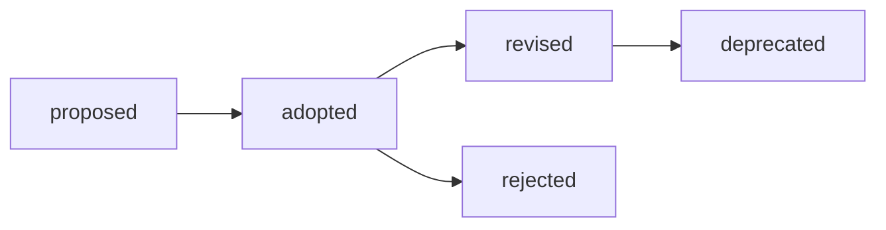

# Pattern lifecycle

Patterns move through a small evidence-based lifecycle:

A new pattern needs a public source, a recurring engineering problem, a practical example, an enforcement classification, a test or review procedure, and an exception policy. Guidance is adapted and attributed; external documents are not copied into this repository.
